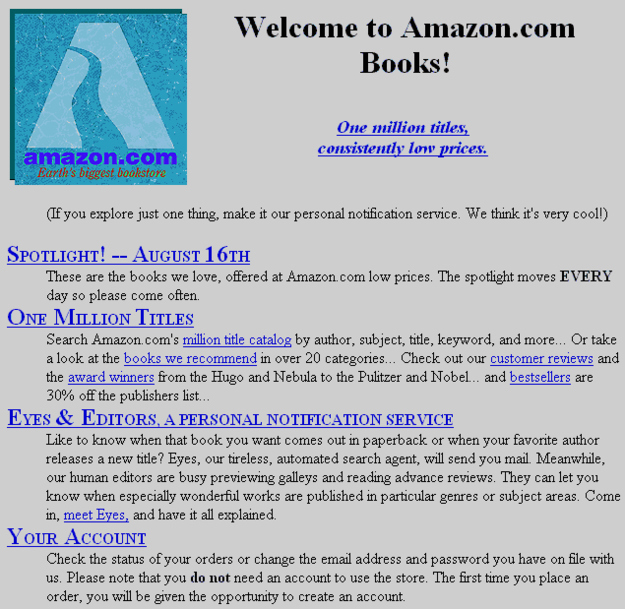

class: middle, center

# Introduction to Javascript
Imperial Cubesat, Software Engineering

---

# Goals
- **Part 1**: Web development 101
  - How does a webpage work?
  - What is HTML, CSS and Javascript
- **Part 2**: Introduction to Javascript
  - Basic syntax, writing functions.
  - Drawing on the HTML5 Canvas element

---
class: center

# How does a webpage work?

.half-slide.lfl.centered[
**Amazon 1995**

]
--
.half-slide.rfl.centered[
**Amazon 2015**

]

---

# How did a webpage work in 1995?

- A webpage is just a **static document** containing
formatted text, images and links to other webpages.
The contents of a webpage and how it should appear on the screen are described
in *HTML* and *CSS*.
--

  - A *client* requests a webpage from a *server* and maybe passes along
  some extra data using his web browser.
  This is done over *HTTP* (Hypertext Transfer Protocol).
  - The server generates the page depending on what the client sent,
  or just reads the webpage from a file.
  Then it trasmits the webpage back to client.
  - The client's web browser renders the webpage on the screen.
--

- The webpage is **completely static** in the sense that it does not change
after it has been loaded, can not interact with the user
or with external services.
--

- To achieve any kind of interactivity a new webpage must be requested
from the server each time the user wants for something to happen.
--

## .center.red[**Boring, not very useful!**]
---

### .left[Today:]

.half-slide.lfl[]
.half-slide.rfl[]
--

## .clear.center[Webpages are complete applications]
--
class: center
--

*Thanks to...*
--

# Javascript .red[❤]!

---

# How does a 2015 webpage work?
- **HTML**, or Hypertext Markup Language defines the contents of the page.
- **CSS**, or Cascading Style Sheet defines how these contents are displayed,
i.e. how the webpage looks.
- **Javascript** is a programming language that defines how the page behaves.
It interacts with the user, sends and receives data from a webserver,
modifies the HTML and CSS of the webpage and even do things like 3D graphics.

.center[HTML and CSS are **.red[not]** programming languages.]

--

```html
<span class='centered'>
  HTML and CSS are <em>not</em> programming languages.
</span>
```

```css
.centered {
  text-align: center;
}

em {
  font-weight: bold;
  color: red;
}
```

